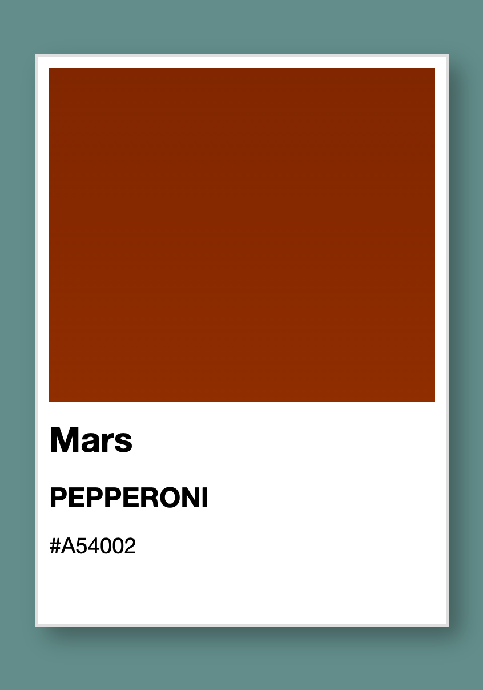

# Ejemplo de la famosa tarjeta pantone con Astro y tailwindcss

## Requisitos: Node 21.6.2

## Iniciar proyecto
* npm install o pnpm install
* npm run nodemon o pnpm run nodemon

## Estructura de archivos y carpetas
* **src/Layouts:** estructura principal de la web y estilos principales
* **src/fonts:** fuentes necesarias
* **src/pages:** fichero principal de la aplicación
* **src/components:** componente que renderiza la tarjeta pantone

